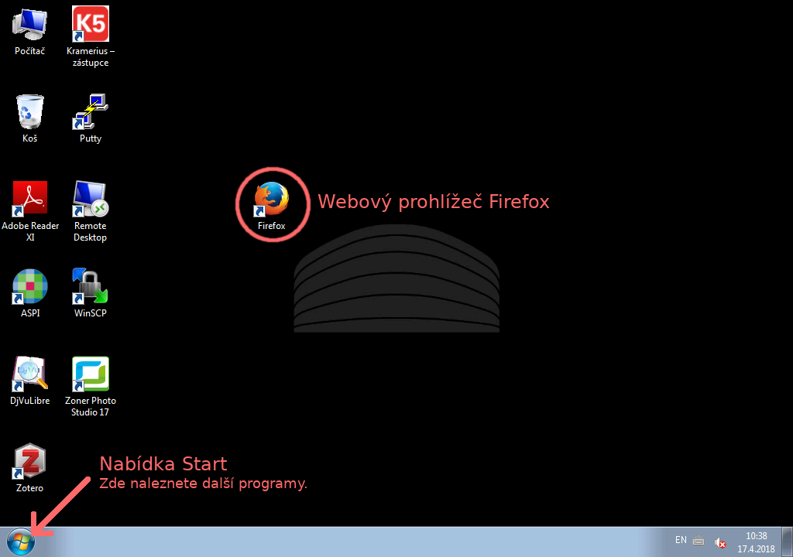
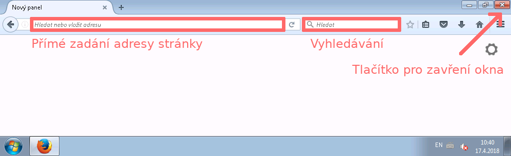
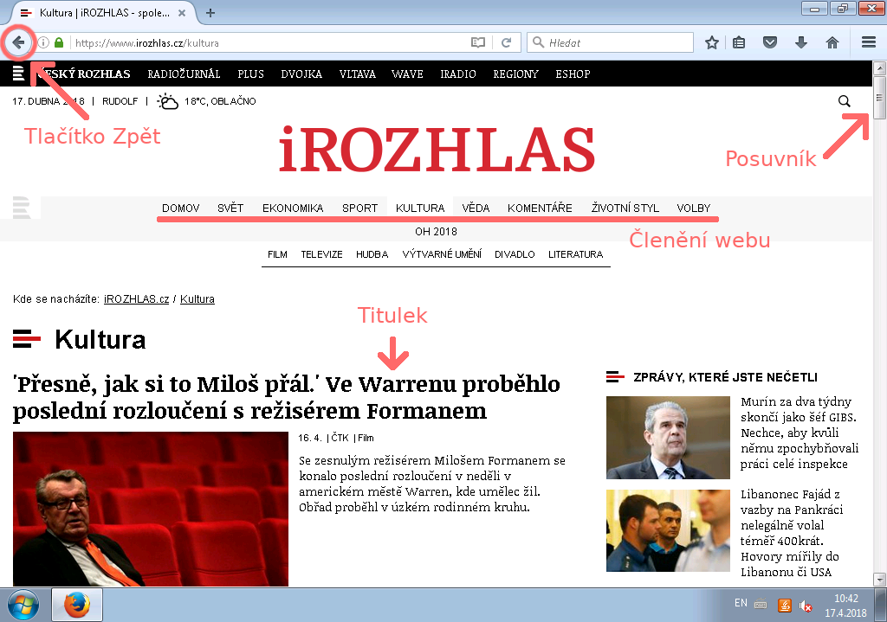
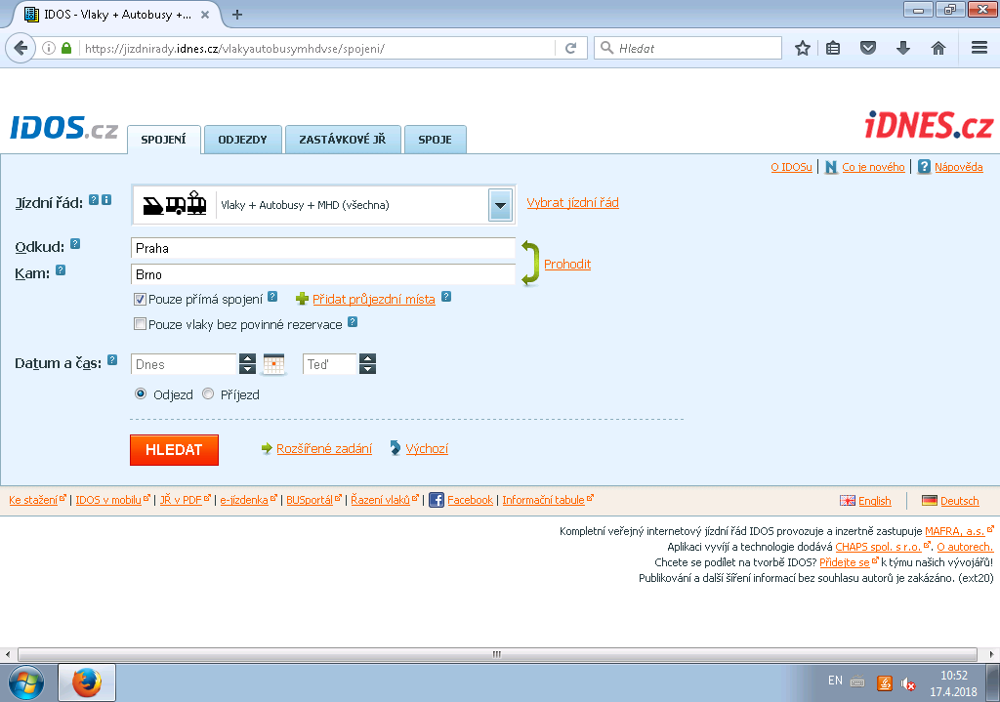
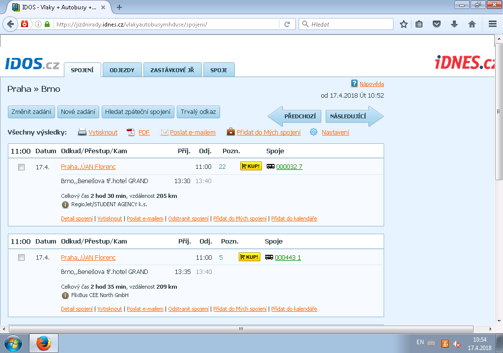

= 1. lekce: Plocha, prohlížeč a práce s webem
//:numbered:
:icons: font
:lang: cs
:note-caption: Poznámka
:warning-caption: Pozor
:table-caption: Tabulka
:figure-caption: Obrázek
:example-caption: Příklad
:toc-title: Obsah
:toc: left
:toclevels: 3
:sectnumlevels: 6
:source-highlighter: pygments

== Plocha a ikony

Po spuštění počítače nebo po uzavření všech oken aplikací se dostaneme na tzv. **Plochu**, na které nalezneme ikony vybraných aplikací. Na spodní hraně je pak vždy přítomná lišta s tlačítkem **Start**, které může mít v různých verzích různou podobu.

.Plocha s ikonami a tlačítkem Start

=== Spouštíme aplikaci na ploše

1. Najeďte šipkou myši na ikonu aplikace na ploše.

2. Poklepejte levým tlačítkem myši (klikněte dvakrát v rychlém sledu). +
   Pokud se Vám dvojité kliknutí nedaří, je možné kliknout jednou a poté stisknout klávesu **Enter**.

=== Spouštíme aplikaci z nabídky Start

1. Najeďte šipkou myši na tlačítko nabídky Start v levém dolním rohu.

2. Klikněte jednou levým tlačítkem myši.

3. Otevře se nabídka start.

4. Najeďte šipkou myši na ikonu či název aplikace.

5. Klikněte jednou levým tlačítkem myši.

<<<

== Zacházení s prohlížečem

Pokud se Vám podařilo úspěšně spustit prohlížeč, zobrazí se jeho okno.

.Spuštěný prohlížeč Firefox

Pole pro zadání adresy stránky::
Do pole můžete kliknout a zadat adresu, kterou již znáte. Poté stiskněte **Enter** a prohlížeč danou stránku zobrazí.

Pole pro vyhledávání::
Do pole můžete kliknout a zadat hledaný pojem. Poté stiskněte **Enter** a prohlížeč otevře výsledky vyhledávání.

Tlačítko pro zavření okna::
Kliknutím na toto tlačítko po skončení své práce zavřete okno prohlížeče.

=== Běžné prohlížeče

Na obrázku výše je sice webový prohlížeč **Firefox**, ale prohlížečů, se kterými se můžete setkat, je podstatně více. Vyjmenováváme ty nejčastější.

[cols="<1,<9", frame=none, grid=none]
|===
| image:img/prohlizec-edge.png[pdfwidth=40vw]
| **Edge**, dříve **Internet Explorer** je prohlížeč od společnosti Microsoft. +
  Je běžnou součástí systému **Windows**.

| image:img/prohlizec-chrome.png[pdfwidth=40vw]
| **Chrome** je prohlížeč od společnosti Google. +
  Je aktuálně nejrozšířenějším prohlížečem.

| image:img/prohlizec-safari.png[pdfwidth=40vw]
| **Safari** je prohlížeč od společnosti Apple. +
  Je běžnou součástí tabletů a mobilních telefonů téhož výrobce.

| image:img/prohlizec-firefox.png[pdfwidth=40vw]
| **Firefox** je prohlížeč od nadace Mozilla. +
  Aktuálně je nejrychlejší a dbá na soukromí uživatelů.
|===

<<<

== Zpravodajství Českého rozhlasu

Na adrese `irozhlas.cz` naleznete webové zpravodajství Českého rozhlasu, které je dostupné zdarma a bez všudypřítomných reklam.

.Zpravodajský web irozhlas.cz

=== Práce s webem

Posouvání textu::
Hlavní stránka tohoto webu je dlouhá a na obrazovku se celá nevejde. Pokud chcete pokračovat ve čtení, musíte použít kolečko myši nebo posuvník po pravé straně okna.

Klikání na odkazy::
Obsah tohoto webu je členěn do obvyklých sekcí _"z domova"_, _"ze světa"_ a podobně. Zkuste se přesunout do kulturní sekce. Konkrétní článek je možné otevřít kliknutím na jeho titulek.

Návrat na předchozí stránku::
Po kliknutí na odkaz je vždy možné se vrátit na předchozí stránku. K tomu slouží tlačítko **Zpět**, které naleznete v levé horní části okna prohlížeče.

<<<

=== Cvičení

. Otevřete si stránky zpravodajství Českého rozhlasu.
. Přesuňte se do kulturní sekce.
. Zjistěte, s kým dělali redaktoři v poslední době rozhovory a o čem.

[cols="<1,<2", options="header"]
|===
| Host
| Téma

| {nbsp}
|

| {nbsp}
|

| {nbsp}
|
|===

=== Poznámky

Zde je prostor pro Vaše vlastní poznámky.

<<<

== Jízdní řády

Na adrese `idos.cz` naleznete aplikaci pro vyhledávání v jízdních řádech, která je dostupná zdarma, bohužel však s reklamou. Provozovatelem je skupina Mafra, data poskytují jednotliví přepravci.

.Aplikace idos.cz (hledání)

=== Hledání spojení

1. Po kliknutí do pole označeného **Jízdní řád** je možné si z nabídky kliknutím vybrat ten, který potřebujeme. Například Pražskou integrovanou dopravu.

2. Do pole označeného **Odkud** je třeba zadat počáteční stanici (například **Kobylisy**) a následně do pole označeného **Kam** stanici cílovou (například **Poliklinika Mazurská**).

3. Pokud nechceme cestovat ihned, ale až později, do polí **Datum a čas** vyplníme kdy plánujeme vyrazit.

4. Kliknutím na tlačítko **Hledat** se pak přesuneme na seznam doporučených tras.

<<<

=== Nalezená spojení

Při vyhledání spojení pro cestu z Prahy do Brna mohou vypadat výsledky například následovně.

.Aplikace idos.cz (výsledky)

==== Orientace ve výsledcích

Předchozí a následující spojení::
V pravé horní části, nad konkrétními spoji, se nachází dvě velké šipky. Kliknutím na šipku označnou **Předchozí** se zobrazí stránka s dřívějšími spoji a naopak kliknutím na šipku označnou **Následující** se zobrazí spoje, které vyráží později.

Informace o trase::
Kliknutím na název (číslo) dopravního prostředku je možné se seznámit s jeho jízdním řádem na dané trase. Kliknutím na **Detail spojení** se pak otevře nové (malé) okno prohlížeče, ve kterém je trasa podrobně rozepsána po stanicích. Toto okno je možné po prostudování zavřít křížkem v pravém horním rohu.

<<<

=== Cvičení

. Otevřete si stránku pro hledání v jízdních řádech.
. Přepněte jízdní řády na hledání ve vlakových spojích.
. Zjistěte informace o nejbližším rychlíku z Těšína do Prahy.

[cols="<1,^3,>1", options="header"]
|===
| Odjezd
| Přestup
| Příjezd

| {nbsp}
|
|
|===

=== Poznámky

Zde je prostor pro Vaše vlastní poznámky.

// vim:set spelllang=cs,en:
