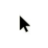

= 2. lekce: Práce s mapou a encyklopedií
//:numbered:
:icons: font
:lang: cs
:note-caption: Poznámka
:warning-caption: Pozor
:table-caption: Tabulka
:figure-caption: Obrázek
:example-caption: Příklad
:toc-title: Obsah
:toc: left
:toclevels: 3
:sectnumlevels: 6
:source-highlighter: pygments

== Opakování

Minule jsme se spolu naučili otevřít webový prohlížeč a najít si zprávy na portálu Českého rozhlasu. Také jsme se naučili nalézt dopravní spojení v rámci Česka. Pojďme se nyní pokusit tyto schopnosti zkombinovat.

1. Otevřete si zpravodajství Rozhlasu na adrese `irozhlas.cz`.

2. Přejděte do sekce **Archiv** a zjistěte, kde se 6. ledna 2018 konaly mimořádné volby.

3. Nalezněte vlakové spojení, kterým byste se do této obce mohli zajet podívat.

=== Poznámky

Zde je prostor pro Vaše vlastní poznámky.

<<<

== Wikipedie

Wikipedie je Internetová encyklopedie, kterou píší a redigují dobrovolníci. Naleznete ji na adrese `cs.wikipedia.org`. Ačkoliv nemusí být informace, které v ní naleznete, vždy zcela přesné, je dobrým zdrojem základních faktů.

.Úvodní stránka Wikipedie

=== Práce s encyklopedií

1. Zkuste si do vyhledávacího pole zadat název obce, kterou se dnes zabýváme.

2. Zjistěte původní německý název obce, nadmořskou výšku a počet obyvatel.

<<<

== Mapy.cz

Nyní si zkusíme naší obec vyhledat na mapě.

.Otevřená mapa s vyhledáváním

=== Práce s mapou

1. Otevřete si aplikaci na adrese `mapy.cz`.

2. Zadejte název obce z opakování, za ním udělejte čárku a napiště název okresu.

3. Oddalte mapu tak, aby byla jasně patrná poloha obce v rámci Česka.

<<<

=== Plánování trasy

Pokud bychom se chtěli do cíle dostat místo vlaku automobilem, využijeme možnost automatického plánování trasy.

.Otevřená mapa s plánováním trasy

1. Přepněte se do **Plánování**.

2. Zadejte název místa, ze kterého budete vyrážet. Například *Rezidence RoSa*.

3. Potvrďte výběrem z nabídky, která se Vám zobrazila.

<<<

== Teorie: Kurzory myši

Možná jste si všimli, že kurzor myši občas změní svůj tvar. Co jednotlivé tvary znamenají?

[cols="<1,<9", frame=none, grid=none]
|===
| 
| Základní ukazatel může ukazovat na neaktivní plochu,
  ale také na tlačítko, které můžete stisknout nebo na plochu,
  kterou můžete posouvat. Je nutné **usuzovat z kontextu**.

| 
| Zaneprázděný kurzor s rotujícím symbolem nebo přesýpacími hodinami. +
  Signalizuje, že počítač **nemusí reagovat** na Vaše pokyny ihned, **vyčkejte**.

| 
| Symbol prstu se zobrazí tehdy, když ukazujete na aktivní prvek. +
  Nejčasteji ho uvidíte při najetí na **odkaz v prohlížeči**.

| 
| Tento symbol naznačuje pozici v textu. Díky jeho tvaru je snazší vybrat
  myší úryvek, nebo **přesunout kurzor při zadávání textu**.
|===

<<<

== Domácí úkol

Do příští lekce zkuste pomocí Wikipedie odpovědět na následující otázky:

1. Kdy vznikl Český rozhlas?

2. Kdy začala Československá televize vysílat barevně?

3. Kdy vznikl "web" (WWW) a jaká je adresa nejstaršího serveru na světě?

4. Najděte na mapě instituci, ve které web vznikl a zjistěte, jak dlouho se tam z Prahy jede autem.

// vim:set spelllang=cs,en:
